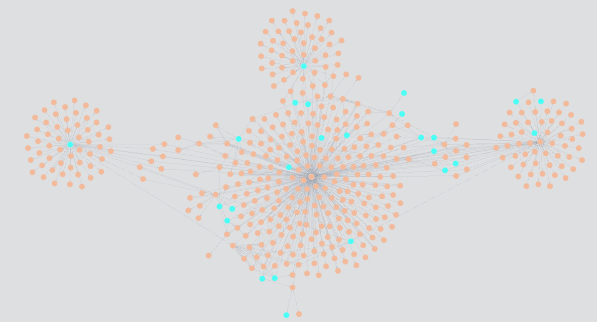
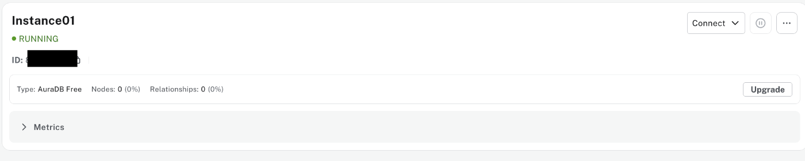
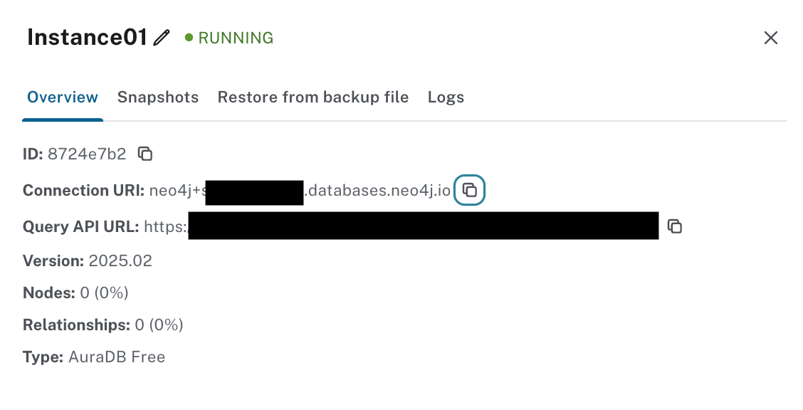

# RAG Study

This repository contains source code for studying Retrieval Augmented Generation (RAG).

# Setup
```bash
rye sync
```

# Data
RAG用のデータは`database`ディレクトリに配置してください。以下の2ファイルのみ、サンプルとしてリポジトリ管理下においてあります。

- 種子島.pdf
    - [https://ja.wikipedia.org/wiki/%E7%A8%AE%E5%AD%90%E5%B3%B6](https://ja.wikipedia.org/wiki/%E7%A8%AE%E5%AD%90%E5%B3%B6) 2025/3/6 アクセス
- 屋久島.pdf
    - [https://ja.wikipedia.org/wiki/%E5%B1%8B%E4%B9%85%E5%B3%B6](https://ja.wikipedia.org/wiki/%E5%B1%8B%E4%B9%85%E5%B3%B6) 2025/3/6 アクセス


# Contents
## GraphRAG
<div align="center">
  <br>
  
</div>

[blog](https://zenn.dev/zenkigen_tech/articles/0a25b2eaefb304)

### グラフデータベースの立ち上げ

1. [neo4j](https://neo4j.com/) にアクセスし、ログイン。
2. Create instance をクリック。
3. とりあえず試すだけなら無料枠で十分です。`AuraDB Free` を選択。
4. `Username` と `Password` が表示されるので控える（この後インスタンスが立ち上がるのに少し時間がかかる）。
5. 右側の「・・・」をクリックし、表示される `inspect` をクリックすると `Connection URI` が表示されるので、それも控える。


*neo4j 上で AuraDB が立ち上がった画面のスクリーンショット。右側の「・・・」から `Connection URI` を確認できます。。*



*`Connection URI` の確認画面。*

### 環境変数

`.env` ファイルを作成し、[グラフデータベースの立ち上げ](#%E3%82%B0%E3%83%A9%E3%83%95%E3%83%87%E3%83%BC%E3%82%BF%E3%83%99%E3%83%BC%E3%82%B9%E3%81%AE%E7%AB%8B%E3%81%A1%E4%B8%8A%E3%81%92)で控えた内容を書きます。LLM の設定は、各自の環境に合わせてください。

```txt:.env
# neo4j の設定
NEO4J_USERNAME="neo4j"
NEO4J_URI=neo4j+s://*******.databases.neo4j.io
NEO4J_PASSWORD=*******
# LLM の設定
project_id=*******
location=*******
model_id=*******
```

### 実行
まずはナレッジグラフの構築です。LLM がドキュメントを読み込んでナレッジを作るので、少々時間がかかります。

```bash
rye run src/graph_rag/make_knowledge_graph.py
```

次に、質問クエリを投げて、ナレッジグラフから情報を抽出します。
`graph_retrieval.py` の `QUESTION` を自由に書き換えて実験してみてください。

```python
QUESTION = "屋久島と種子島はどこにありますか？"
```

実行は以下のコマンドです。

```bash
rye run src/graph_rag/graph_retrieval.py
```